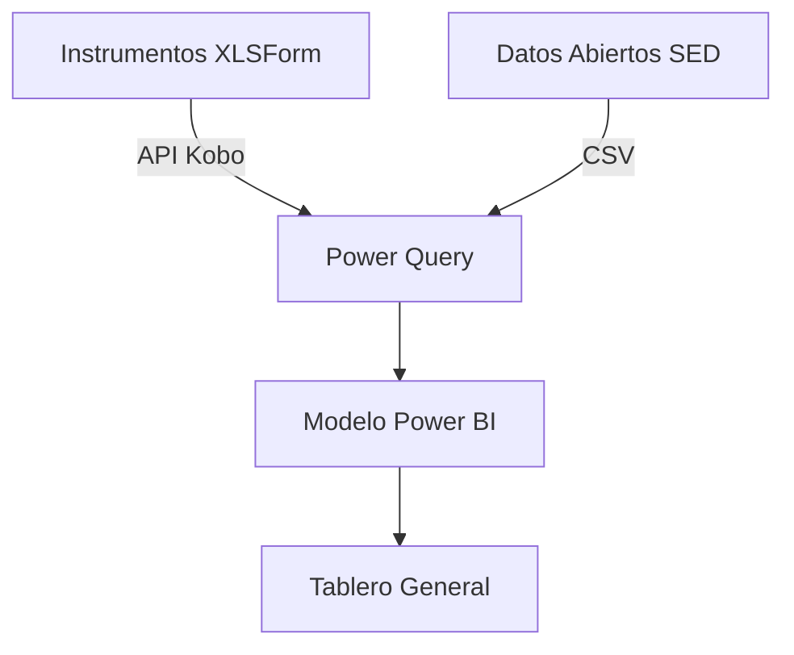

# Tablero General

**Plataforma:** Power BI  
**Ámbito:** Convenio United Way Colombia – Secretaría de Educación Distrital (SED)  
**Versión documentada:** 8.0  
**URL:** https://app.powerbi.com/view?r=eyJrIjoiNzMwYWY3MjEtYTQ1OS00YTUxLWFlODAtZWMwMDQyYmJiZjBmIiwidCI6Ijk4YzUyOTJjLTZmODUtNDU2NS04YWNlLTk2OWRhZGE3ODgwOCIsImMiOjR9


---
En este tablero se consolida la situación actual, la evolución y los resultados clave del proyecto de fortalecimiento pedagógico en prejardín, jardín y transición de las IED suscritas al convenio, integrando:

- Datos capturados directamente en los instrumentos (XLSForm → KoboToolbox → Power BI)  
- Información en el proyecto datos abiertos gov. de la SED (matrícula, caracterización IED, ubicación, jornadas, etc.)  
- Indicadores de rendimiento actualizables en tiempo real  

## Arquitectura de datos

| Capa | Origen | Frecuencia de carga | Descripción |
|------|--------|--------------------|-------------|
| **Origen primario** | XLSForm (KoboToolbox) | Diaria (API) | Respuestas brutas de los 4 instrumentos documentados |
| **Origen secundario** | Datos Abiertos SED |  (CSV publicado) | caracterización IED, geolocalización, jornadas, zonas |
| **Transformación** | Power Query (Power BI) | Diaria | Limpieza, estandarización de códigos DANE, cálculo de indicadores |
| **Modelo** | Star Schema | — | Hechos: respuestas, observaciones, fotos. Dimensiones: tiempo, docente, IED, sede, localidad, grado |
| **Visualización** | Power BI Service | — | Dashboard interactivo con segmentadores, drill-through y DAX |

## Fuentes detalladas y relaciones



| Instrumento | Archivo base | Tabla en modelo | Llave relación |
|-------------|--------------|-----------------|----------------|
| **Caracterización I** | `Encuesta...IED.xlsx` | `dimDocente` + `factCaracterizacion` | `cod_dane_ied` + `num_doc_docente` |
| **Procesos de valoración** | `Instrumento...desarrollo infantil.xlsx` | `factValoracion` | `cod_dane_ied` + `nombre_docente` |
| **Observación de calidad** v1 y v2 | `Instrumento...inicial.xlsx` | `factObservacion` | `cod_dane_ied` + `fecha_visita` |
| **Fotografía ambientes** | `Fotografía...aprendizaje.xlsx` | `factFotos` (URLs) | `cod_dane_ied` + `fecha` |
| **Datos abiertos SED** | `ied_basica_media.csv` + `matricula_eo_2025.csv` | `dimIED` + `dimSede` + `dimLocalidad` | `cod_dane_ied` (único) |

---

## Indicadores clave (KPIs visibles en página principal)

| Indicador | Fórmula DAX resumida | Interpretación |
|-----------|----------------------|----------------|
| **Cobertura del proyecto** | `DISTINCTCOUNT(factCaracterizacion[num_doc_docente]) / DISTINCTCOUNT(dimIED[total_docentes_ied])` | % de docentes de la IED que ya respondieron Caracterización I |
| **Avance por instrumento** | `COUNTROWS(factValoracion) / DISTINCTCOUNT(factCaracterizacion[num_doc_docente])` | Proporción de docentes que completaron valoración vs. caracterización |
| **Puntuación promedio de observación** | `AVERAGEX(factObservacion, RELATED(dimCriterio[puntaje]))` | Promedio de 18 criterios (0-18) por IED |
| **IEDs con ≥ 80 % de criterios evidenciados** | `COUNTROWS(FILTER(dimIED, [puntuación_obs] >= 14.4))` | Meta de calidad pedagógica |
| **Fotografías por ambiente** | `COUNTROWS(factFotos)` / `DISTINCTCOUNT(factFotos[cod_dane_ied])` | Densidad de evidencias visuales |

---

## Vistas y páginas del tablero

| Página | Función principal | Segmentadores globales |
|--------|-------------------|------------------------|
| **Resumen Ejecutivo** | KPIs, tarjetas, tendencias mensuales | Localidad, fecha, tipo de instrumento |
| **Cobertura** | Mapa (Shapefile Bogotá) + barras de % de respuesta | Grado, jornada, zona |
| **Calidad Pedagógica** | Scatter puntuación vs. matrícula; matrices de criterios | IED, docente, número de visita |
| **Valoración y Seguimiento** | Donut de frecuencia de registros; líneas de tiempo | Mes, grado, tipo de registro |
| **Evidencias Visuales** | Galería dinámica de fotos con filtro por IED y fecha | Código DANE, grado, tipo de rincón |
| **Análisis Comparativo** | Tabla dinámica que cruza resultados de los 4 instrumentos por IED | Localidad, zona, rango de puntuación |


## Glosario rápido de campos clave

| Campo en modelo | Origen | Significado |
|-----------------|--------|-------------|
| `cod_dane_ied` | SED / Kobo | Código único 10 dígitos IED |
| `num_doc_docente` | Kobo | Llave única del docente dentro del proyecto |
| `puntaje_obs` | Calculado | Suma de “Se evidencia” (1) por visita (0-18) |
| `url_foto` | Kobo | URL pública de imagen almacenada en Kobo (expira 90 días; se replica a SharePoint) |
| `matricula_total_eo` | SED | Matrícula oficial prejardín + jardín + transición 2025 |

---

## 9. Enlaces directos (solo usuarios autorizados)

| Recurso | URL |
|---------|-----|
| Tablero General (lectura) | [https://app.powerbi.com/groups/xxxxx/reports/yyyyy](https://app.powerbi.com/groups/xxxxx/reports/yyyyy) |
| Dataset (editores) | [https://app.powerbi.com/groups/xxxxx/datasets/zzzzz](https://app.powerbi.com/groups/xxxxx/datasets/zzzzz) |
| Carpeta de datos | [https://uwc.sharepoint.com/sites/edinicial/datos](https://uwc.sharepoint.com/sites/edinicial/datos) |
| Repositorio GitHub | [https://github.com/uwcolombia/fortalecimiento-edu-inicial](https://github.com/uwcolombia/fortalecimiento-edu-inicial) |

---

> **Nota:** los enlaces reales se completan una vez se genere el workspace definitivo. Esta documentación se mantiene bajo control de versión en `/docs/tablero-general.md` del repositorio.
```
